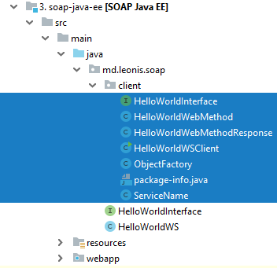

# Simple examples of SOAP JAX-WS servers and clients for Maven and Java 8
# Простые примеры серверов и клиентов SOAP JAX-WS для Maven и Java 8

Серия примеров, рассчитанная на современного программиста, не знакомого с SOAP, WSDL и JAX-WS.
Рассчитана на быстрое знакомство с технологией, без глубокого погружения в теоретические дебри.

Читать следует в таком порядке:

* [Основы JAX-WS и SOAP для современного программиста](doc/chapter-1.md)
* [SOAP HelloWorld для Java SE](doc/chapter-2.md)


## SOAP RPC

`RPC` это второй вариант, как можно написать веб-сервис. Идея такая же, как и в случае `DOCUMENT`, но над интерфейсом дополнительно ставится аннотация `@SOAPBinding(style = Style.RPC)`

Сначала протокол `SOAP` задумывался для удалённого вызова процедур, но сейчас с его помощью можно обмениваться произвольными сообщениями в формате `XML`. 
`RPC` (Remote Procedure Call) подходит для работы с примитивными типами. Попробуйте, например, запросить массив с данными – он вернётся пустым. 

**SOAP PRC в производстве использовать не стоит, и далее мы не будем его рассматривать.**

## SOAP HelloWorld для Java EE

Веб-сервисы почти так же легко можно разворачивать в серверах приложений.

Проблема выбора и установки сервера приложений выходит за рамки этой статьи. Мы будем пользоваться `WildFly` (бывший JBoss).

Файл `pom.xml` не сильно изменился. Основные отличия:

```xml
<packaging>war</packaging>

    <properties>
        <failOnMissingWebXml>false</failOnMissingWebXml>
    </properties>
```

Интерфейс:

```java
package md.leonis.soap;

import javax.jws.WebMethod;
import javax.jws.WebService;

@WebService(name = "HelloWorldInterface", targetNamespace = "http://soap.leonis.md/")
public interface HelloWorldInterface {

    @WebMethod
    String helloWorldWebMethod(String name);
}
```

Сервис:

```java
package md.leonis.soap;

import javax.jws.WebService;

@WebService(serviceName = "serviceName", portName = "portName",
      endpointInterface = "md.leonis.soap.HelloWorldInterface", targetNamespace = "http://soap.leonis.md/")
public class HelloWorldWS implements HelloWorldInterface {

   @Override
   public String helloWorldWebMethod(String name) {
      return "Hello World JAX-WS " + name;
   }
}
```

Обратите внимание на поля аннотации `@WebService`:

* `serviceName` - возможность переименовать сервис. То есть, снаружи он будет виден как `serviceName`. По умолчанию `HelloWorldWSService`.
* `portName` - возможность переименовать порт. То есть, снаружи он будет виден как `portName`. По умолчанию `HelloWorldWSPort`.
* `endpointInterface` - это полное имя реализуемого интерфейса. 
* `targetNamespace` - по умолчанию это элементы названия пакета переставленные наоборот. Спереди добавляется `"http://"`, сзади `"/"`.
То есть, в нашем примере это поле избыточно. Уж если указываете, то в одном месте. Если значения для интерфейса и сервиса будут различаться, то это приведёт к тяжёлым последствиям при генерации WSDL файла.
* `name` нельзя использовать вместе с полем `endpointInterface`. По-сути, это синоним для веб-службы. Уж если используем, 
то клиент должен быть несколько иным: `HelloWorldInterface hello = service.getPort(new QName("http://soap.leonis.md/", "namePort"), HelloWorldInterface.class);`
* `wsdlLocation` - путь к WSDL файлу, очевидно, если название файла. Обычно указывать не требуется. По умолчанию генерируется автоматически при запуске ендпоинта. 
Пример `wsdlLocation = "wsdl/HelloWorldWSService.wsdl"`. Пример ошибки, если WSDL файл не был найден 
`Exception in thread "main" com.sun.xml.internal.ws.server.ServerRtException: [failed to localize] cannot.load.wsdl(MyService.wsdl)`

Возможные поля для аннотации `@WebMethod`:

* `operationName` - имя операции, связанной с текущим методом. По умолчанию это название самого метода. То есть, это возможность переименовать метод и не более того.
* `action` - действие для этой операции. По умолчанию что-то вроде `http://soap.leonis.md/HelloWorldInterface/helloWorldWebMethodRequest`. Для SOAP связывания это значение SOAPAction заголовка.
* `exclude` - возможность не показывать метод в веб-сервисе. Надо указывать только в классе-реализации сервиса, при этом первые два элемента недопустимы.

Собираем, деплоим, смотрим логи сервера.

```
Adding service endpoint metadata: id=md.leonis.soap.HelloWorldWS
 address=http://localhost:8080/soap-java-ee-1.0-SNAPSHOT/serviceName
 implementor=md.leonis.soap.HelloWorldWS
 serviceName={http://soap.leonis.md}serviceName
 portName={http://soap.leonis.md}portName
 annotationWsdlLocation=null
 wsdlLocationOverride=null
 mtomEnabled=false
Creating Service {http://soap.leonis.md}serviceName from class md.leonis.soap.HelloWorldInterface
Setting the server's publish address to be http://localhost:8080/soap-java-ee-1.0-SNAPSHOT/serviceName
WSDL published to: file:/C:/wildfly/standalone/data/wsdl/soap-java-ee-1.0-SNAPSHOT.war/serviceName.wsdl
```

Ендпоинт `md.leonis.soap.HelloWorldWS` доступен по адресу `http://localhost:8080/soap-java-ee-1.0-SNAPSHOT/serviceName`, так же видим название порта. 
`WSDL` файл генерируется автоматически и сохраняется на диск где-то в недрах контейнера.

Все перечисленные значения знакомые, мы их указали в аннотациях. Это было сделано с одной целью – показать, что настраивать, на самом деле, можно много чего.

Ничто нам не мешает тут же вызвать этот сервис, или, хотя бы, получить его WSDL файл, но URL не слишком-то и красивый. Давайте его улучшим. 
В каталоге `/main` создадим каталог `webapp/WEB-INF`, а в нём файл `jboss-web.xml`. Для других контейнеров существуют аналогичные инструменты настройки.

```xml
<?xml version="1.0" encoding="UTF-8"?>
<jboss-web xmlns="http://www.jboss.com/xml/ns/javaee"
           xmlns:xsi="http://www.w3.org/2001/XMLSchema-instance"
           xsi:schemaLocation="
      http://www.jboss.com/xml/ns/javaee
      http://www.jboss.org/j2ee/schema/jboss-web_5_1.xsd">
    <context-root>/hello</context-root>
</jboss-web>
```

Только что мы заменили название артефакта `soap-java-ee-1.0-SNAPSHOT` на простое “`hello`”. Смотрим логи сервера:

```
Adding service endpoint metadata: id=md.leonis.soap.HelloWorldWS
 address=http://localhost:8080/hello/serviceName
 implementor=md.leonis.soap.HelloWorldWS
 serviceName={http://soap.leonis.md}serviceName
 portName={http://soap.leonis.md}portName
 annotationWsdlLocation=null
 wsdlLocationOverride=null
 mtomEnabled=false
Creating Service {http://soap.leonis.md}serviceName from class md.leonis.soap.HelloWorldInterface
Setting the server's publish address to be http://localhost:8080/hello/serviceName
```

*Если очень хочется, то можно указать `<context-root>/</context-root>` и получить ещё более простой URL: `http://localhost:8080/serviceName`*

Кстати, если кто не знает, есть возможность ещё немного настроить ендпоинты. Там же создаём файл `web.xml`:

```xml
<?xml version="1.0"?>
<web-app xmlns="http://xmlns.jcp.org/xml/ns/javaee"
         xmlns:xsi="http://www.w3.org/2001/XMLSchema-instance"
         xsi:schemaLocation="http://xmlns.jcp.org/xml/ns/javaee
		 http://xmlns.jcp.org/xml/ns/javaee/web-app_3_1.xsd" 
         version="3.1">

    <servlet>
        <servlet-name>Hello World WebService</servlet-name>
        <servlet-class>md.leonis.soap.HelloWorldWS</servlet-class>
    </servlet>
    <servlet-mapping>
        <servlet-name>Hello World WebService</servlet-name>
        <url-pattern>/newEndpoint</url-pattern>
    </servlet-mapping>

</web-app>
```

Логи:

```
Adding service endpoint metadata: id=Hello World WebService
 address=http://localhost:8080/hello/newEndpoint
 implementor=md.leonis.soap.HelloWorldWS
 serviceName={http://soap.leonis.md}serviceName
 portName={http://soap.leonis.md}portName
 annotationWsdlLocation=null
 wsdlLocationOverride=null
 mtomEnabled=false
Creating Service {http://soap.leonis.md}serviceName from class md.leonis.soap.HelloWorldInterface
Setting the server's publish address to be http://localhost:8080/hello/newEndpoint
```

## Генерация SOAP-клиента

Давайте воспользуемся существующим WSDL документом, чтобы сгенерировать клиента для нашей веб-службы. Для этого отлично подойдёт утилита `wsimport` из `JDK`, её настройки во многом напоминают `wsgen`:

`wsimport -d ./target/classes -s ./src/main/java -verbose -p md.leonis.soap.client http://localhost:8080/hello/newEndpoint?wsdl`

WSDL файл скачивается и на его основе генерируется целое семейство классов:



Класс `HelloWorldWSClient`, правда, ещё предстоит написать, но он является упрощённой версией клиентов, которые мы видели ранее:

```java
public class HelloWorldWSClient {
 
   public static void main(String[] args) {
        Service service = new ServiceName();
        HelloWorldInterface hello = service.getPort(HelloWorldInterface.class);
        System.out.println(hello.helloWorldWebMethod("Leonis"));
    }
}
```

Утилита `wsimport` может так же работать и с `WSDL-файлами`, пример такого параметра: `-wsdlLocation ../src/resources/META-INF/service.wsdl`

При работе с фреймворком `Apache CXF` можно воспользоваться следующей утилитой:

`wsdl2java.bat -p md.leonis.soap -client -server -impl -wsdlLocation classpath:wsdl/HelloWorldWSService.wsdl HelloWorldWSService.wsdl`
`wsdl2java.bat -p md.leonis.soap -client -server -impl -wsdlLocation classpath:wsdl/ServiceName.wsdl ServiceName.wsdl`

В данном случае из `WSDL` и `XSD` файлов генерируются сразу клиент, сервер, а также реализация-заглушка. 
Отдельно следует обратить внимание на ключ `-wsdlLocation classpath:wsdl/HelloWorldWSService.wsdl`. 
Он говорит о том, что WSDL файл `HelloWorldWSService.wsdl` в приложении будет находиться в каталоге `/resources/wsdl`. Вот пример сгенерированного сервиса:

```java
public class HelloWorldWSService extends Service {

    public final static URL WSDL_LOCATION;

    public final static QName SERVICE = new QName("http://soap.leonis.md/", "HelloWorldWSService");
    public final static QName HelloWorldWSPort = new QName("http://soap.leonis.md/", "HelloWorldWSPort");
    static {
        URL url = HelloWorldWSService.class.getClassLoader().getResource("wsdl/HelloWorldWSService.wsdl");
        if (url == null) {
            java.util.logging.Logger.getLogger(HelloWorldWSService.class.getName())
                .log(java.util.logging.Level.INFO,
                     "Can not initialize the default wsdl from {0}", "classpath:wsdl/HelloWorldWSService.wsdl");
        }
        WSDL_LOCATION = url;
    }
```

Если не указать ключ `-wsdlLocation classpath:wsdl/HelloWorldWSService.wsdl`, то сервис будет несколько иным:

```java
    public final static QName SERVICE = new QName("http://soap.leonis.md/", "HelloWorldWSService");
    public final static QName HelloWorldWSPort = new QName("http://soap.leonis.md/", "HelloWorldWSPort");
    static {
        URL url = null;
        try {
            url = new URL("file:HelloWorldWSService.wsdl");
        } catch (MalformedURLException e) {
            java.util.logging.Logger.getLogger(HelloWorldWSService.class.getName())
                .log(java.util.logging.Level.INFO,
                     "Can not initialize the default wsdl from {0}", "file:HelloWorldWSService.wsdl");
        }
        WSDL_LOCATION = url;
    }
   
```

Тут очень тонкий момент - если клиент будет деплоиться в контейнер, то первый вариант сгодится.

Весь остальной исходный код доступен в репозитории. Обратите внимание, что клиент в случае `Apache CXF` генерируется сразу, не надо ничего писать. 

Подробнее об этой замечательной утилите можно прочесть тут: https://cxf.apache.org/docs/wsdl-to-java.html

**Это тот минимальный "джуниорский" набор знаний, который необходим для начала работы с JAX-WS и SOAP. Всё остальное есть на просторах сети.**


## Динамическое подключение к серверу

Врядли это кому-нибудь пригодится на производстве, но есть возможность динамически подключаться к необходимым веб-службам.
Пример такого клиента: 

```java
URL url = new URL("http://localhost:8080/for/dispatcher?wsdl");
QName qname = new QName("http://soap.leonis.md/", "HelloWorldWSService");
Service service = Service.create(url, qname);

Dispatch<Source> helloDispatch =
       service.createDispatch(
               new QName("http://soap.leonis.md/", "HelloWorldWSPort"),
               Source.class, Service.Mode.PAYLOAD);
String request = "<ns2:helloWorldWebMethod xmlns:ns2=\"http://soap.leonis.md/\">\n" +
       "\t\t\t\t<arg0>Leonis</arg0>\n" +
       "\t\t\t</ns2:helloWorldWebMethod>";
Source requestSource = new StreamSource(new StringReader(request));
Source responseSource = helloDispatch.invoke(requestSource);
Result responseResult = new StreamResult(System.out);
Transformer transformer = TransformerFactory.newInstance().newTransformer();
transformer.transform(responseSource, responseResult);
```

Результат в консоли:

`<?xml version="1.0" encoding="UTF-8"?><ns2:helloWorldWebMethodResponse xmlns:ns2="http://soap.leonis.md/" xmlns:S="http://schemas.xmlsoap.org/soap/envelope/"><return>Hello World JAX-WS Leonis</return></ns2:helloWorldWebMethodResponse>Disconnected from the target VM, address: '127.0.0.1:49650', transport: 'socket'`

Имеется возможность вызывать даже те операции, которые не были определены в WSDL файле

```java
Service helloService = Service.create(new QName("http://samples/hello", "HelloService"));
helloService.addPort(
     new QName("http://samples/hello", "HelloPort"),
     SOAPBinding.SOAP11HTTP_BINDING,
     "http://localhost/hello"
);
```

Естественно, вызываемый сервис должен быть доступен.

`WebServiceProvider` предоставляет аналогичную функциональность для динамического создания веб-служб.


## SOAP HelloWorld для Java SE с BASIC Authentication 

Давайте рассмотрим пример того, как написать клиент для работы с защищёнными ендпоинтами.
Начнём с очень простого случая - будем передавать в заголовках имя пользователя с паролем.

### Случай с именем пользователя и паролем

Интерфейс сервиса. Ничего необычного:

```java
@WebService
   public interface HelloWorld {
   
       @WebMethod
       String getHelloWorldAsStringPassword();
   }
```

Реализация сервиса. Для обращения к заголовкам нам понадобится контекст веб-сервисов `WebServiceContext`.
Из него можно достать много полезной информации, но сейчас нас интересуют HTTP-заголовки.

```java
@WebService(endpointInterface = "md.leonis.soap.HelloWorld")
public class HelloWorldImpl implements HelloWorld {

    @Resource
    WebServiceContext webServiceContext;

    @Override
    public String getHelloWorldAsStringPassword() {

        MessageContext messageContext = webServiceContext.getMessageContext();

        Map http_headers = (Map) messageContext.get(MessageContext.HTTP_REQUEST_HEADERS);

        List userList = (List) http_headers.get("username");
        List passList = (List) http_headers.get("password");

        String username = "";
        String password = "";

        if (userList != null) {
            username = userList.get(0).toString();
        }

        if (passList != null) {
            password = passList.get(0).toString();
        }

        if (username.equals("user") && password.equals("password")) {
            return "Hello World JAX-WS - Valid User!";
        } else {
            return "Unknown User!";
        }
    }
}
```

Происходит простейшая проверка имени пользователя и пароля. Проверок в коде явно маловато, он написан в учебных целях.

Паблишер обычный:

```java
public class HelloWorldPublisher {

    public static void main(String[] args) {
        Endpoint.publish("http://localhost:8080/hello", new HelloWorldImpl());
    }
}
```

А вот в клиенте появились новые конструкции:

```java
public class HelloWorldClient {

    private static final String WS_URL = "http://localhost:8080/hello?wsdl";

    public static void main(String[] args) throws Exception {

        URL url = new URL(WS_URL);
        QName qname = new QName("http://soap.leonis.md/", "HelloWorldImplService");

        Service service = Service.create(url, qname);
        HelloWorld hello = service.getPort(HelloWorld.class);

        Map<String, Object> req_ctx = ((BindingProvider) hello).getRequestContext();

        Map<String, List<String>> headers = new HashMap<>();
        headers.put("username", Collections.singletonList("user"));
        headers.put("password", Collections.singletonList("password"));

        req_ctx.put(MessageContext.HTTP_REQUEST_HEADERS, headers);

        System.out.println(hello.getHelloWorldAsStringPassword());
        System.out.println(hello.getHelloWorldAsStringBasic());
    }
}
```

Мы получаем объект `BindingProvider`, провайдер связывания, который, по-сути тоже очень многофункциональный.
Через него обращаемся к контексту запроса и добавляем в него необходимые нам заголовки.
Вот как теперь выглядит контекст запроса:


Вместо `"username"` и `"password"` можно использовать `BindingProvider.USERNAME_PROPERTY` и `BindingProvider.PASSWORD_PROPERTY`, правда,
надо помнить, что:

* USERNAME_PROPERTY = "javax.xml.ws.security.auth.username";
* PASSWORD_PROPERTY = "javax.xml.ws.security.auth.password";

То есть, при отправке и получении надо использовать эти же константы.

### Случай с BASIC Authentication 

По сравнению с предыдущим примером нам мало чего придётся поменять.

Клиент: отправляем валидный заголовок. Он будет примерно таким: `Basic dXNlcjpwYXNzd29yZA==`:

```java
String usernameColonPassword = "user:password";
String basicAuthPayload = "Basic " + Base64.getEncoder().encodeToString(usernameColonPassword.getBytes());
headers.put("Authorization", Collections.singletonList(basicAuthPayload));
```

Сервис: разбираем этот заголовок:

```java
List authList = (List) http_headers.get("Authorization");

String username = "";
String password = "";

if (authList != null && authList.get(0).toString().toLowerCase().startsWith("basic")) {
   String basicAuthPayload = authList.get(0).toString();
   String payload = basicAuthPayload.replace("Basic ", "");
   byte[] decodedBytes = Base64.getDecoder().decode(payload);
   String usernameColonPassword = new String(decodedBytes);
   String[] values = usernameColonPassword.split(":");
   username = values[0];
   password = values[1];
}
```

Всё просто, правда, серверную часть так никто не пишет. Обычно контейнер сервлетов берёт вопросы аутентификации на себя.
Да и клиент врядли будет хранить пароли внутри себя. Куда разумнее передавать их извне.

## SOAP HelloWorld для Java EE с BASIC Authentication 

Этот пример более приближен к реальной жизни.

Сначала добавим пользователя приложения в `Wildfly`:

В `bin` каталоге `WildFly` выполняем команду `add-user.bat`:

Добавим пользователя `user` с паролем `password`.


Если кому интересно, то в файлах `application-roles.properties` (их два) будет: `user=USER_ROLE`

а в файлах `application-users.properties` (их два) будет: `user=70fa846ee00b3dd28dbcbe83fb38a660`

Теперь настраиваем файл `web.xml`:

Для простоты закроем доступ ко всем ресурсам сервера:

```xml
    <security-constraint>
        <web-resource-collection>
            <web-resource-name>BASIC-Auth</web-resource-name>
            <description>Security constraints</description>
            <url-pattern>/*</url-pattern>
        </web-resource-collection>
        <auth-constraint>
            <role-name>USER_ROLE</role-name>
        </auth-constraint>
    </security-constraint>

    <login-config>
        <auth-method>BASIC</auth-method>
        <realm-name>ApplicationRealm</realm-name>
    </login-config>

    <security-role>
        <role-name>USER_ROLE</role-name>
    </security-role>
```


### Защита методов аннотацией RolesAllowed


Защищаем метод `helloWorldWebMethod` веб-сервиса следующей аннотацией:

`@RolesAllowed("USER_ROLE")`

Теперь


Деплоим сервис в контейнере и успешно получаем `WSDL`-файл, авторизовавшись как `user`.


А теперь вопрос - как написать клиент? Все клиенты, рассмотренные ранее читали WSDL файл напрямую из ендпоинта. А в нашем случае он закрыт.

Давайте возьмём уже сгенерированный клиент из примера `SOAP HelloWorld для Java EE` и будем его модифицировать.

### Прямая аутентификация

Одно из возможных решений - аутентифицироваться до того, как произойдёт обращение к ендпоинту.

В классе ServiceName добавляем в `static` блок следующий код:

```java
Authenticator myAuth = new Authenticator() {
    @Override
    protected PasswordAuthentication getPasswordAuthentication() {
         return new PasswordAuthentication("user", "password".toCharArray());
    }
};

Authenticator.setDefault(myAuth);
```

Это очень простое решение, но к сожалению, в производстве оно не всегда применимо, поскольку, имя пользователя и пароль
могут храниться в базе данных или каком-то защищённом хранилище, или, в файле настроек.

### Работа с сохранённым WSDL-файлом

Давайте сохраним WSDL-файл и будем использовать его вместе с проектом. Открываем ссылку `http://localhost:8080/hello/serviceName?wsdl`.
Сохраним его как `ServiceName.wsdl` в каталоге `resources/wsdl`.

Будем работать с классом `ServiceName`.

Сначала уберём из аннотации `@WebServiceClient` - `wsdlLocation`. Чтение происходит при старте, в это время у нас ещё нет данных для аутентификации.

```java
@WebServiceClient(name = "serviceName", targetNamespace = "http://soap.leonis.md/", wsdlLocation = "http://localhost:8080/hello/serviceName?wsdl")
```

Далее модифицируем статический блок.

```java
        URL url = null;
        WebServiceException e = null;
        try {
            url = Service.class.getClassLoader().getResource("wsdl/ManageExchangeWSDL.WSDL");
        } catch (Exception ex) {
            e = new WebServiceException(ex);
        }
        SERVICENAME_WSDL_LOCATION = url;
        SERVICENAME_EXCEPTION = e;
```

Поскольку в этом решении мы читаем из ресурсов, то и выполнять надо уже JAR-файл.

```
mvn clean package
java -jar ./target/soap-java-ee-basic-auth-client-1.0-SNAPSHOT.jar 
```

Всё работает. 

А как быть при отладке в `IDE`? Можно, например, передавать полный путь к WSDL-файлу в командной строке.

Класс `HelloWorldWSClient`:

```java
Service service;

if (args.length > 0) {
    service = new ServiceName(args[0]);
} else {
    service = new ServiceName();
}
```

Класс `ServiceName` мы отрефакторим.

```java
import javax.xml.namespace.QName;
import javax.xml.ws.*;
import java.io.File;
import java.net.URL;

/**
 * This class was generated by the JAX-WS RI.
 * JAX-WS RI 2.2.9-b130926.1035
 * Generated source version: 2.2
 * <p>
 * Modified!!!
 */
@WebServiceClient(name = "serviceName", targetNamespace = "http://soap.leonis.md/")
public class ServiceName extends Service {

    private static URL SERVICENAME_WSDL_LOCATION;
    private final static QName SERVICENAME_QNAME = new QName("http://soap.leonis.md/", "serviceName");

    public ServiceName() {
        super(getWsdlLocation(null), SERVICENAME_QNAME);
    }

    public ServiceName(String wsdlPath) {
        super(getWsdlLocation(wsdlPath), SERVICENAME_QNAME);
    }

    /**
     * @return returns HelloWorldInterface
     */
    @WebEndpoint(name = "portName")
    public HelloWorldInterface getPortName() {
        return super.getPort(new QName("http://soap.leonis.md/", "portName"), HelloWorldInterface.class);
    }

    /**
     * @param features A list of {@link WebServiceFeature} to configure on the proxy.  Supported features not in the <code>features</code> parameter will have their default values.
     * @return returns HelloWorldInterface
     */
    @WebEndpoint(name = "portName")
    public HelloWorldInterface getPortName(WebServiceFeature... features) {
        return super.getPort(new QName("http://soap.leonis.md/", "portName"), HelloWorldInterface.class, features);
    }

    private static URL getWsdlLocation(String wsdlPath) {
        if (SERVICENAME_WSDL_LOCATION != null) {
            return SERVICENAME_WSDL_LOCATION;
        }

        try {
            if (wsdlPath != null) {
                SERVICENAME_WSDL_LOCATION = new File(wsdlPath).toURI().toURL();
            } else {
                SERVICENAME_WSDL_LOCATION = ServiceName.class.getClassLoader().getResource("wsdl/ServiceName.wsdl");
            }
        } catch (Exception ex) {
            throw new WebServiceException(ex);
        }

        return SERVICENAME_WSDL_LOCATION;
    }

}
```

Теперь этот класс сначала пытается обратиться к файлу, переданному из командной строки, а если его нет, то читает из ресурсов.


На этом всё, жду любые замечания и вопрос на почту.