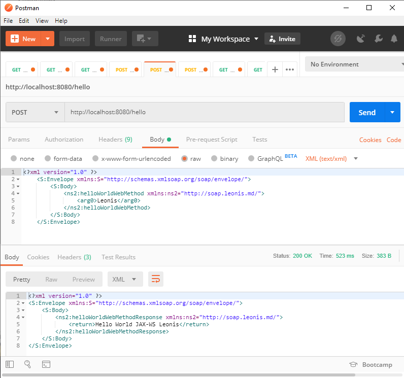

# Simple examples of SOAP JAX-WS servers and clients for Maven and Java 8

# Основы JAX-WS и SOAP для современного программиста

Честно говоря, не известно сколько ещё современных Java-проектов используют SOAP. В-основном, это должны быть очень старые проекты, или проекты поновее, которым приходится “общаться” со старичками.

Технология SOAP, особенно, если начать вникать в неё глубоко, является непростой, а после знакомства с REST вообще складывается впечатление, что SOAP это просто невероятно заумная технология.

Например, почему бы просто не отправлять XML-документы, получив, ко всему прочему, прирост производительности?

Новичок видит непонятную груду классов, сопровождающих сервисы, совсем не очевидный XML, и думает “зачем так сложно-то?”

Добивает ситуацию громадное разнообразие примеров и документации в сети, среди которых даже примеры уровня HelloWorld вызывают откровенное недоумение.

В этом документе мы постараемся взглянуть на SOAP с другой стороны. Тут не будет теории, её хватает в сети.

*Запомните. Не стремитесь сразу же читать WSDL файлы. Это только введёт в заблуждение. Они создаются роботами для роботов. Начните с самого минимального примера, и разобравшись, 
как он работает, можно будет разобраться и с более тяжёлыми примерами.*

Итак, SOAP. Это всего лишь ещё один протокол обмена данными в сети. Его отличительная особенность – платформонезависимость. XML сообщения одинаково хорошо отправляются 
и принимаются на Linux, Windows и других системах. То есть, Windows-клиент может работать с Linux-сервером и наоборот. 

SOAP-сообщение хранится в конверте (envelope). Как и в случае конверта почтовых сообщений, в нём есть заголовок (header) и тело (body). В отличие от REST, SOAP не привязан к HTTP, 
однако, чаще всего он используется именно поверх HTTP.

При разработке SOAP приложений используется два принципа. Обычно на стороне сервера пишется код, потом на его основе генерируется WSDL файл, и уже на стороне клиента на основе 
этого WSDL-файла генерируются классы клиента.

Все примеры ниже рассчитаны на `Java 8` и `Maven`. Для Java 9 и выше всё чуть-чуть интереснее, надо будет подключать дополнительные зависимости.

https://stackoverflow.com/questions/51892528/migration-jaxws-application-from-java-8-to-java-11

## SOAP HelloWorld для Java SE

Давайте напишем простейший SOAP веб-сервис. Для его работы не нужен будет даже сервер приложений. В pom.xml никаких специальных зависимостей не требуется.

Надо сразу понять - в SOAP без интерфейса никуда. Если им пренебречь, то получится ошибка: `Exception in thread "main" java.lang.IllegalArgumentException: md.leonis.soap.HelloWorldWS is not an interface`.

```
package md.leonis.soap;

import javax.jws.WebMethod;
import javax.jws.WebService;
import javax.jws.soap.SOAPBinding;
import javax.jws.soap.SOAPBinding.Style;
import java.util.ArrayList;

@WebService
@SOAPBinding(style = Style.DOCUMENT)
public interface HelloWorldInterface {

   @WebMethod
   String helloWorldWebMethod(String name);

   @WebMethod
   ArrayList<String> helloWorldArrayListWebMethod(String name);
}
```

Прошу прощение за названия классов и методов, это было сделано специально, чтобы лучше показать принцип. 
Обычно интерфейс и реализация называются: `HelloWorld`, `HelloWorldImpl`. Благодаря аннотациям веб-сервисы получаются компактными и понятными. 
У каждой аннотации несколько параметров, не поленитесь почитать, для чего они нужны.

```
@WebService(endpointInterface = "md.leonis.soap.HelloWorldInterface")
public class HelloWorldWS implements HelloWorldInterface {

   @Override
   public String helloWorldWebMethod(String name) {
      return "Hello World JAX-WS " + name;
   }

   @Override
   public ArrayList<String> helloWorldArrayListWebMethod(String name) {
      return new ArrayList<>(Arrays.asList("Response", helloWorldWebMethod(name)));
   }
}
```

Веб-сервис `HelloWorldWS` реализует интерфейс `HelloWorldInterface`. Для `endpointInterface` нужно указать полное имя реализуемого интерфейса `md.leonis.soap.HelloWorldInterface`. 
Если этого не сделать, то получим `Exception in thread "main" javax.xml.ws.WebServiceException: Undefined port type: {http://soap.leonis.md/}HelloWorldInterface`.

Сервис готов, но надо его запустить. Для этого напишем ещё один класс.

```
package md.leonis.soap;

import javax.xml.ws.Endpoint;

public class HelloWorldWSPublisher {

    public static void main(String[] args) {
        Endpoint.publish("http://localhost:8080/hello", new HelloWorldWS());
        Endpoint.publish("http://localhost:8080/hello2", new HelloWorldWS());
    }
}
```

Обратите внимание, что публикуется два ендпоинта. Публиковать можно любое количество. После публикации последнего ендпоинта приложение не завершает свою работу, а находится в режиме ожидания запросов.

Давайте сразу напишем ещё и клиент.

```
package md.leonis.soap;

import javax.xml.namespace.QName;
import javax.xml.ws.Service;
import java.net.URL;

public class HelloWorldWSClient {
 
   public static void main(String[] args) throws Exception {
 
      URL url = new URL("http://localhost:8080/hello?wsdl");
 
        QName qname = new QName("http://soap.leonis.md/", "HelloWorldWSService");
 
        Service service = Service.create(url, qname);
 
        HelloWorldInterface hello = service.getPort(HelloWorldInterface.class);
 
        System.out.println(hello.helloWorldWebMethod("Leonis"));
        System.out.println(hello.helloWorldArrayListWebMethod("Leonis"));
    }
}
```

* В `url` мы указали путь к WSDL файлу (добавляем `?wsdl` к опубликованному ендпоинту).
* В `Qualified Name` нельзя допускать ошибок. Если не знаете, что писать, то напишите любой текст и запустите клиента. В сообщении об ошибке будут содержаться правильные значения для `namespaceUri` и `localPart`.

`Exception in thread "main" javax.xml.ws.WebServiceException: {http://soap.leonis2.md/}HelloWorldWSService is not a valid service. Valid services are: {http://soap.leonis.md/}HelloWorldWSService`

* Обратите внимание на `namespaceUri`. Это название пакета "`md.leonis.soap`", развёрнутое наоборот, в виде URL: "`http://soap.leonis.md/`".
* Так же обратите внимание на `localPart`. Это название нашего сервиса `HelloWorldWS` + “`Service`”.

Далее создаём объект `Service`, берём нужный порт и вызываем его методы. Это типовой код, его можно просто использовать, не задумываясь об особенностях реализации.

Всё готово к запуску.

`mvn clean package`

Запускаем `Publisher`, затем `Client` и если всё было сделано верно, то результат вызова веб-сервиса будет таким:

```
Hello World JAX-WS Leonis
[Response, Hello World JAX-WS Leonis]
```

У SOAP веб-сервиса можно запросить `WSDL` документ. Но лучше сначала открыть `XSD` документ и посмотреть, что там внутри. Откроем в браузере ссылку: http://localhost:8080/hello?xsd=1

```
<?xml version="1.0" encoding="UTF-8"?>
<!-- Published by JAX-WS RI (http://jax-ws.java.net). RI's version is JAX-WS RI 2.2.9-b130926.1035 svn-revision#5f6196f2b90e9460065a4c2f4e30e065b245e51e. -->
<xs:schema xmlns:tns="http://soap.leonis.md/" xmlns:xs="http://www.w3.org/2001/XMLSchema" version="1.0" targetNamespace="http://soap.leonis.md/">
    <xs:element name="helloWorldArrayListWebMethod" type="tns:helloWorldArrayListWebMethod"></xs:element>
    <xs:element name="helloWorldArrayListWebMethodResponse" type="tns:helloWorldArrayListWebMethodResponse"></xs:element>
    <xs:element name="helloWorldWebMethod" type="tns:helloWorldWebMethod"></xs:element>
    <xs:element name="helloWorldWebMethodResponse" type="tns:helloWorldWebMethodResponse"></xs:element>
    <xs:complexType name="helloWorldWebMethod">
        <xs:sequence>
            <xs:element name="arg0" type="xs:string" minOccurs="0"></xs:element>
        </xs:sequence>
    </xs:complexType>
    <xs:complexType name="helloWorldWebMethodResponse">
        <xs:sequence>
            <xs:element name="return" type="xs:string" minOccurs="0"></xs:element>
        </xs:sequence>
    </xs:complexType>
    <xs:complexType name="helloWorldArrayListWebMethod">
        <xs:sequence>
            <xs:element name="arg0" type="xs:string" minOccurs="0"></xs:element>
        </xs:sequence>
    </xs:complexType>
    <xs:complexType name="helloWorldArrayListWebMethodResponse">
        <xs:sequence>
            <xs:element name="return" type="xs:string" minOccurs="0" maxOccurs="unbounded"></xs:element>
        </xs:sequence>
    </xs:complexType>
</xs:schema>
```

В этом документе описаны аргументы и возвращаемые значения. Например, можно разобрать, что метод `helloWorldWebMethod` принимает один параметр типа `String` и возвращает тоже строку.

Нам специально не пришлось писать типы `helloWorldWebMethod` и `helloWorldWebMethodResponse`. Если этого очень захочется, то выполните в проекте (там, где `pom.xml`) следующую команду:

`wsgen -cp ./target/classes -s ./src/main/java md.leonis.soap.HelloWorldWS`

Чтобы она отработала успешно, необходимо, чтобы `/bin` директория Java была в `classpath`. Утилита `wsge`n идёт в комплекте с JDK. 
Так же необходимо, чтобы проект был скомпилирован. Утилита wsgen работает с `.class` файлами, а не с `.java`.

В пакете `md.leonis.soap.jaxws` будет создано 4 новых класса. Это то же самое, что описано в WSDL файле, но в более понятном для нас виде.



Можно выполнить кое-что поинтереснее. Все доступные ключи утилиты можно посмотреть, запустив wsgen без параметров, мы воспользуется несколькими из них.

`wsgen -verbose -cp ./target/classes -s ./src/main/java -d ./target/classes md.leonis.soap.HelloWorldWS -wsdl -r ./src/main/resources/wsdl`

В этом примере мы сразу же создаём `.java`, `.class` файлы, а что самое важное – `WSDL` и `XSD` файлы. Команда сразу не выполнится, надо будет создать все необходимые директории.

Морально мы уже готовы. Откроем в браузере ссылку на WSDL:

http://localhost:8080/hello?wsdl

```
<?xml version="1.0" encoding="UTF-8"?>
<!-- Published by JAX-WS RI (http://jax-ws.java.net). RI's version is JAX-WS RI 2.2.9-b130926.1035 svn-revision#5f6196f2b90e9460065a4c2f4e30e065b245e51e. -->
<!-- Generated by JAX-WS RI (http://jax-ws.java.net). RI's version is JAX-WS RI 2.2.9-b130926.1035 svn-revision#5f6196f2b90e9460065a4c2f4e30e065b245e51e. -->
<definitions xmlns:wsu="http://docs.oasis-open.org/wss/2004/01/oasis-200401-wss-wssecurity-utility-1.0.xsd" xmlns:wsp="http://www.w3.org/ns/ws-policy" xmlns:wsp1_2="http://schemas.xmlsoap.org/ws/2004/09/policy" xmlns:wsam="http://www.w3.org/2007/05/addressing/metadata" xmlns:soap="http://schemas.xmlsoap.org/wsdl/soap/" xmlns:tns="http://soap.leonis.md/" xmlns:xsd="http://www.w3.org/2001/XMLSchema" xmlns="http://schemas.xmlsoap.org/wsdl/" targetNamespace="http://soap.leonis.md/" name="HelloWorldWSService">
    <types>
        <xsd:schema>
            <xsd:import namespace="http://soap.leonis.md/" schemaLocation="http://localhost:8080/hello?xsd=1"></xsd:import>
        </xsd:schema>
    </types>
    <message name="helloWorldWebMethod">
        <part name="parameters" element="tns:helloWorldWebMethod"></part>
    </message>
    <message name="helloWorldWebMethodResponse">
        <part name="parameters" element="tns:helloWorldWebMethodResponse"></part>
    </message>
    <message name="helloWorldArrayListWebMethod">
        <part name="parameters" element="tns:helloWorldArrayListWebMethod"></part>
    </message>
    <message name="helloWorldArrayListWebMethodResponse">
        <part name="parameters" element="tns:helloWorldArrayListWebMethodResponse"></part>
    </message>
    <portType name="HelloWorldInterface">
        <operation name="helloWorldWebMethod">
            <input wsam:Action="http://soap.leonis.md/HelloWorldInterface/helloWorldWebMethodRequest" message="tns:helloWorldWebMethod"></input>
            <output wsam:Action="http://soap.leonis.md/HelloWorldInterface/helloWorldWebMethodResponse" message="tns:helloWorldWebMethodResponse"></output>
        </operation>
        <operation name="helloWorldArrayListWebMethod">
            <input wsam:Action="http://soap.leonis.md/HelloWorldInterface/helloWorldArrayListWebMethodRequest" message="tns:helloWorldArrayListWebMethod"></input>
            <output wsam:Action="http://soap.leonis.md/HelloWorldInterface/helloWorldArrayListWebMethodResponse" message="tns:helloWorldArrayListWebMethodResponse"></output>
        </operation>
    </portType>
    <binding name="HelloWorldWSPortBinding" type="tns:HelloWorldInterface">
        <soap:binding transport="http://schemas.xmlsoap.org/soap/http" style="document"></soap:binding>
        <operation name="helloWorldWebMethod">
            <soap:operation soapAction=""></soap:operation>
            <input>
                <soap:body use="literal"></soap:body>
            </input>
            <output>
                <soap:body use="literal"></soap:body>
            </output>
        </operation>
        <operation name="helloWorldArrayListWebMethod">
            <soap:operation soapAction=""></soap:operation>
            <input>
                <soap:body use="literal"></soap:body>
            </input>
            <output>
                <soap:body use="literal"></soap:body>
            </output>
        </operation>
    </binding>
    <service name="HelloWorldWSService">
        <port name="HelloWorldWSPort" binding="tns:HelloWorldWSPortBinding">
            <soap:address location="http://localhost:8080/hello"></soap:address>
        </port>
    </service>
</definitions>
```

Кроме аргументов, которые уже нам знакомы по `XSD` файлу тут есть порты и операции. Так же описан сам сервис и способ, как можно до него достучаться. 
Повторюсь, __ни один человек в здравом уме не станет писать такой файл вручную__. Уж тем более, что это очень примитивный пример, в реальной жизни код может достигать десятки килобайт! 
Так что, не стоит сильно грустить по поводу того, что WSDL такой непонятный. Читать его будут роботы, а не люди.

*WSDL (Web Services Description Language) — язык описания веб-сервисов и доступа к ним, основанный на языке XML. Это документ, с помощью которого можно написать клиента для веб-службы. 
Если говорить простым языком, то в нём перечислены методы сервиса, их аргументы и возвращаемые данные. На самом деле, всё, конечно, намного сложнее.*

Работа клиента `HelloWorldWSClient` скрывает то, что происходит на самом деле. А на самом деле, даже если вызывается самый простой сервис, ему передаётся `XML` документ, и отвечает он тоже на `XML-языке`. 
Общение ведётся с помощью HTTP-метода `POST`.

`POST http://localhost:8080/hello`

Тело запроса:

```
<?xml version="1.0" ?>
	<S:Envelope xmlns:S="http://schemas.xmlsoap.org/soap/envelope/">
		<S:Body>
			<ns2:helloWorldWebMethod xmlns:ns2="http://soap.leonis.md/">
				<arg0>Leonis</arg0>
			</ns2:helloWorldWebMethod>
		</S:Body>
	</S:Envelope>
```

Если не обращать внимание на формат конверта (в нём даже нет заголовка, только тело), то перед нами обычный вызов метода, описанный необычным образом. 
Методу `helloWorldWebMethod` из пространства имён `http://soap.leonis.md/` передаётся аргумент `“Leonis”`. Это, конечно, не совсем так, но так размышлять проще. 
На самом деле, мы передаём объект-контейнер `helloWorldWebMethod`, в котором хранится один аргумент. Сервер знает, что с ним дальше делать.

Ответ так же возвращается в виде объекта-контейнера `helloWorldWebMethodResponse`:

```
<?xml version="1.0" ?>
<S:Envelope xmlns:S="http://schemas.xmlsoap.org/soap/envelope/">
    <S:Body>
        <ns2:helloWorldWebMethodResponse xmlns:ns2="http://soap.leonis.md/">
            <return>Hello World JAX-WS Leonis</return>
        </ns2:helloWorldWebMethodResponse>
    </S:Body>
</S:Envelope>
```


Аналогично можно запросить массив данных.

Запрос:

```
<?xml version="1.0" ?>
	<S:Envelope xmlns:S="http://schemas.xmlsoap.org/soap/envelope/">
		<S:Body>
			<ns2:helloWorldArrayListWebMethod xmlns:ns2="http://soap.leonis.md/">
				<arg0>Leonis</arg0>
			</ns2:helloWorldArrayListWebMethod>
		</S:Body>
	</S:Envelope>
```

Ответ: 

```
<?xml version="1.0" ?>
<S:Envelope xmlns:S="http://schemas.xmlsoap.org/soap/envelope/">
    <S:Body>
        <ns2:helloWorldArrayListWebMethodResponse xmlns:ns2="http://soap.leonis.md/">
            <return>Response</return>
            <return>Hello World JAX-WS Leonis</return>
        </ns2:helloWorldArrayListWebMethodResponse>
    </S:Body>
</S:Envelope>
```

Разобравшись с этими простыми примерами, можно по аналогии писать сервисы посложнее и запросы к ним.

## SOAP RPC

`RPC` это второй вариант, как можно написать веб-сервис. Идея такая же, как и в случае `DOCUMENT`, но над интерфейсом дополнительно ставится аннотация `@SOAPBinding(style = Style.RPC)`

Сначала протокол `SOAP` задумывался для удалённого вызова процедур, но сейчас с его помощью можно обмениваться произвольными сообщениями в формате `XML`. 
`RPC` (Remote Procedure Call) подходит для работы с примитивными типами. Попробуйте, например, запросить массив с данными – он вернётся пустым. 

**SOAP PRC в производстве использовать не стоит, и далее мы не будем его рассматривать.**

## SOAP HelloWorld для Java EE

Веб-сервисы почти так же легко можно разворачивать в серверах приложений.

Проблема выбора и установки сервера приложений выходит за рамки этой статьи. Мы будем пользоваться `WildFly` (бывший JBoss).

Файл `pom.xml` не сильно изменился. Основные отличия:

```
<packaging>war</packaging>

    <properties>
        <failOnMissingWebXml>false</failOnMissingWebXml>
    </properties>
```

Интерфейс:

```
package md.leonis.soap;

import javax.jws.WebMethod;
import javax.jws.WebService;

@WebService(name = "HelloWorldInterface", targetNamespace = "http://soap.leonis.md/")
public interface HelloWorldInterface {

    @WebMethod
    String helloWorldWebMethod(String name);
}
```

Сервис:

```
package md.leonis.soap;

import javax.jws.WebService;

@WebService(serviceName = "serviceName", portName = "portName",
      endpointInterface = "md.leonis.soap.HelloWorldInterface", targetNamespace = "http://soap.leonis.md")
public class HelloWorldWS implements HelloWorldInterface {

   @Override
   public String helloWorldWebMethod(String name) {
      return "Hello World JAX-WS " + name;
   }
}
```

Собираем, деплоим, смотрим логи сервера.

```
Adding service endpoint metadata: id=md.leonis.soap.HelloWorldWS
 address=http://localhost:8080/soap-java-ee-1.0-SNAPSHOT/serviceName
 implementor=md.leonis.soap.HelloWorldWS
 serviceName={http://soap.leonis.md}serviceName
 portName={http://soap.leonis.md}portName
 annotationWsdlLocation=null
 wsdlLocationOverride=null
 mtomEnabled=false
Creating Service {http://soap.leonis.md}serviceName from class md.leonis.soap.HelloWorldInterface
Setting the server's publish address to be http://localhost:8080/soap-java-ee-1.0-SNAPSHOT/serviceName
WSDL published to: file:/C:/wildfly/standalone/data/wsdl/soap-java-ee-1.0-SNAPSHOT.war/serviceName.wsdl
```

Ендпоинт `md.leonis.soap.HelloWorldWS` доступен по адресу `http://localhost:8080/soap-java-ee-1.0-SNAPSHOT/serviceName`, так же видим название порта. 
`WSDL` файл генерируется автоматически и сохраняется на диск где-то в недрах контейнера.

Все перечисленные значения знакомые, мы их указали в аннотациях. Это было сделано с одной целью – показать, что настраивать, на самом деле, можно много чего.

Ничто нам не мешает тут же вызвать этот сервис, или, хотя бы, получить его WSDL файл, но URL не слишком-то и красивый. Давайте его улучшим. 
В каталоге `/main` создадим каталог `webapp/WEB-INF`, а в нём файл `jboss-web.xml`. Для других контейнеров существуют аналогичные инструменты настройки.

```
<?xml version="1.0" encoding="UTF-8"?>
<jboss-web xmlns="http://www.jboss.com/xml/ns/javaee"
           xmlns:xsi="http://www.w3.org/2001/XMLSchema-instance"
           xsi:schemaLocation="
      http://www.jboss.com/xml/ns/javaee
      http://www.jboss.org/j2ee/schema/jboss-web_5_1.xsd">
    <context-root>/hello</context-root>
</jboss-web>
```

Только что мы заменили название артефакта `soap-java-ee-1.0-SNAPSHOT` на простое “`hello`”. Смотрим логи сервера:

```
Adding service endpoint metadata: id=md.leonis.soap.HelloWorldWS
 address=http://localhost:8080/hello/serviceName
 implementor=md.leonis.soap.HelloWorldWS
 serviceName={http://soap.leonis.md}serviceName
 portName={http://soap.leonis.md}portName
 annotationWsdlLocation=null
 wsdlLocationOverride=null
 mtomEnabled=false
Creating Service {http://soap.leonis.md}serviceName from class md.leonis.soap.HelloWorldInterface
Setting the server's publish address to be http://localhost:8080/hello/serviceName
```

*Если очень хочется, то можно указать `<context-root>/</context-root>` и получить ещё более простой URL: `http://localhost:8080/serviceName`*

Кстати, если кто не знает, есть возможность ещё немного настроить ендпоинты. Там же создаём файл `web.xml`:

```
<?xml version="1.0"?>
<web-app xmlns="http://xmlns.jcp.org/xml/ns/javaee"
         xmlns:xsi="http://www.w3.org/2001/XMLSchema-instance"
         xsi:schemaLocation="http://xmlns.jcp.org/xml/ns/javaee
		 http://xmlns.jcp.org/xml/ns/javaee/web-app_3_1.xsd" 
         version="3.1">

    <servlet>
        <servlet-name>Hello World WebService</servlet-name>
        <servlet-class>md.leonis.soap.HelloWorldWS</servlet-class>
    </servlet>
    <servlet-mapping>
        <servlet-name>Hello World WebService</servlet-name>
        <url-pattern>/newEndpoint</url-pattern>
    </servlet-mapping>

</web-app>
```

Логи:

```
Adding service endpoint metadata: id=Hello World WebService
 address=http://localhost:8080/hello/newEndpoint
 implementor=md.leonis.soap.HelloWorldWS
 serviceName={http://soap.leonis.md}serviceName
 portName={http://soap.leonis.md}portName
 annotationWsdlLocation=null
 wsdlLocationOverride=null
 mtomEnabled=false
Creating Service {http://soap.leonis.md}serviceName from class md.leonis.soap.HelloWorldInterface
Setting the server's publish address to be http://localhost:8080/hello/newEndpoint
```

## Генерация SOAP-клиента

Давайте воспользуемся существующим WSDL документом, чтобы сгенерировать клиента для нашей веб-службы. Для этого отлично подойдёт утилита `wsimport` из `JDK`, её настройки во многом напоминают `wsgen`:

`wsimport -d ./target/classes -s ./src/main/java -verbose -p md.leonis.soap.client http://localhost:8080/hello/newEndpoint?wsdl`

WSDL файл скачивается и на его основе генерируется целое семейство классов:


Класс `HelloWorldWSClient`, правда, ещё предстоит написать, но он является упрощённой версией клиентов, которые мы видели ранее:

```
public class HelloWorldWSClient {
 
   public static void main(String[] args) {
        Service service = new ServiceName();
        HelloWorldInterface hello = service.getPort(HelloWorldInterface.class);
        System.out.println(hello.helloWorldWebMethod("Leonis"));
    }
}
```

Утилита `wsimport` может так же работать и с `WSDL-файлами`, пример такого параметра: `-wsdlLocation ../src/resources/META-INF/service.wsdl`

При работе с фреймворком `Apache CXF` можно воспользоваться следующей утилитой:

`wsdl2java.bat -p md.leonis.soap -client -server -impl -wsdlLocation classpath:wsdl/HelloWorldWSService.wsdl HelloWorldWSService.wsdl`

В данном случае из `WSDL` и `XSD` файлов генерируются сразу клиент, сервер, а также реализация-заглушка. 
Отдельно следует обратить внимание на ключ `-wsdlLocation classpath:wsdl/HelloWorldWSService.wsdl`. 
Он говорит о том, что WSDL файл `HelloWorldWSService.wsdl` в приложении будет находиться в каталоге `/resources/wsdl`. Вот пример сгенерированного сервиса:

```
public class HelloWorldWSService extends Service {

    public final static URL WSDL_LOCATION;

    public final static QName SERVICE = new QName("http://soap.leonis.md/", "HelloWorldWSService");
    public final static QName HelloWorldWSPort = new QName("http://soap.leonis.md/", "HelloWorldWSPort");
    static {
        URL url = HelloWorldWSService.class.getClassLoader().getResource("wsdl/HelloWorldWSService.wsdl");
        if (url == null) {
            java.util.logging.Logger.getLogger(HelloWorldWSService.class.getName())
                .log(java.util.logging.Level.INFO,
                     "Can not initialize the default wsdl from {0}", "classpath:wsdl/HelloWorldWSService.wsdl");
        }
        WSDL_LOCATION = url;
    }
```

Если не указать ключ `-wsdlLocation classpath:wsdl/HelloWorldWSService.wsdl`, то сервис будет несколько иным:

```
    public final static QName SERVICE = new QName("http://soap.leonis.md/", "HelloWorldWSService");
    public final static QName HelloWorldWSPort = new QName("http://soap.leonis.md/", "HelloWorldWSPort");
    static {
        URL url = null;
        try {
            url = new URL("file:HelloWorldWSService.wsdl");
        } catch (MalformedURLException e) {
            java.util.logging.Logger.getLogger(HelloWorldWSService.class.getName())
                .log(java.util.logging.Level.INFO,
                     "Can not initialize the default wsdl from {0}", "file:HelloWorldWSService.wsdl");
        }
        WSDL_LOCATION = url;
    }
```

Весь остальной исходный код доступен в репозитории. Обратите внимание, что клиент в случае `Apache CXF` генерируется сразу, не надо ничего писать. 

Подробнее об этой замечательной утилите можно прочесть тут: https://cxf.apache.org/docs/wsdl-to-java.html

На этом всё, жду любые замечания и вопрос на почту.