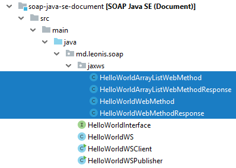
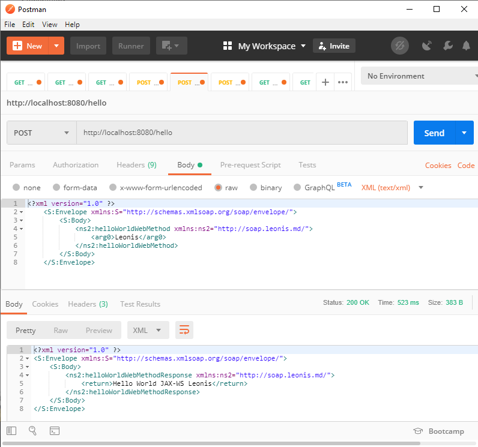

## SOAP HelloWorld для Java SE

Чтобы понять основной принцип, надо написать SOAP веб-сервис. Для его работы не нужен будет даже сервер приложений. 
В pom.xml тоже никаких специальных зависимостей не требуется.

Надо сразу понять - в SOAP без интерфейса никуда. Если им пренебречь, то при запуске клиента вылетит ошибка: `Exception in thread "main" java.lang.IllegalArgumentException: md.leonis.soap.HelloWorldWS is not an interface`.

*Интерфейс это прежде всего контракт, так что пишите контракт а потом уже его конкретную реализацию.*

```java
package md.leonis.soap;

import javax.jws.WebMethod;
import javax.jws.WebService;
import javax.jws.soap.SOAPBinding;
import javax.jws.soap.SOAPBinding.Style;
import java.util.ArrayList;

@WebService
@SOAPBinding(style = Style.DOCUMENT)
public interface HelloWorldInterface {

   @WebMethod
   String helloWorldWebMethod(String name);

   @WebMethod
   ArrayList<String> helloWorldArrayListWebMethod(String name);
}
```

У каждой аннотации несколько параметров, позднее мы их рассмотрим.

Прошу прощение за названия классов и методов, это было сделано специально, чтобы лучше показать принцип работы. 
Обычно интерфейс и реализация в примерах называются: `HelloWorld`, `HelloWorldImpl`. Благодаря аннотациям веб-сервисы получаются компактными и понятными.

Больше теории о том, как правильно именовать веб-сервисы:

* https://docs.oracle.com/cd/E82085_01/150/retail_soa_enabler_tool_guide/or-rse-Standards.htm
* https://www.w3.org/2002/07/soap-translation/russian/part0.html
* https://www.w3.org/TR/soap12-part1/ (Section 3.1.1, Section 5)
* https://www.w3.org/TR/soap12-part2/
* https://www.ehealthontario.on.ca/architecture/education/courses/service-oriented-architecture/downloads/SOA-ServiceNamingConventions.pdf
 
```java
@WebService(endpointInterface = "md.leonis.soap.HelloWorldInterface")
public class HelloWorldWS implements HelloWorldInterface {

   @Override
   public String helloWorldWebMethod(String name) {
      return "Hello World JAX-WS " + name;
   }

   @Override
   public ArrayList<String> helloWorldArrayListWebMethod(String name) {
      return new ArrayList<>(Arrays.asList("Response", helloWorldWebMethod(name)));
   }
}
```

Веб-сервис `HelloWorldWS` реализует интерфейс `HelloWorldInterface`. 
Для `endpointInterface` нужно указать полное имя реализуемого интерфейса `md.leonis.soap.HelloWorldInterface`. 
Если этого не сделать, то в клиенте получим `Exception in thread "main" javax.xml.ws.WebServiceException: Undefined port type: {http://soap.leonis.md/}HelloWorldInterface`.
Как с этим бороться можно прочесть далее.

Сервис готов, но надо его запустить. Для этого напишем ещё один класс.

```java
package md.leonis.soap;

import javax.xml.ws.Endpoint;

public class HelloWorldWSPublisher {

    public static void main(String[] args) {
        Endpoint.publish("http://localhost:8080/hello", new HelloWorldWS());
        Endpoint.publish("http://localhost:8080/hello2", new HelloWorldWS());
    }
}
```

Обратите внимание, что публикуется два ендпоинта. Публиковать можно любое количество. 
После публикации последнего ендпоинта приложение не завершает свою работу, а находится в режиме ожидания запросов.

Давайте сразу напишем ещё и клиент.

```java
package md.leonis.soap;

import javax.xml.namespace.QName;
import javax.xml.ws.Service;
import java.net.URL;

public class HelloWorldWSClient {
 
   public static void main(String[] args) throws Exception {
 
      URL url = new URL("http://localhost:8080/hello?wsdl");
 
        QName qname = new QName("http://soap.leonis.md/", "HelloWorldWSService");
 
        Service service = Service.create(url, qname);
 
        HelloWorldInterface hello = service.getPort(HelloWorldInterface.class);
 
        System.out.println(hello.helloWorldWebMethod("Leonis"));
        System.out.println(hello.helloWorldArrayListWebMethod("Leonis"));
    }
}
```

* В `url` мы указали путь к WSDL файлу (добавляем `?wsdl` к опубликованному ендпоинту).
* В `Qualified Name` нельзя допускать ошибок. Если не знаете, что писать, то напишите любой текст и запустите клиента. 
В сообщении об ошибке будут содержаться правильные значения для `namespaceUri` и `localPart`. Пример:

`Exception in thread "main" javax.xml.ws.WebServiceException: {http://soap.leonis2.md/}HelloWorldWSService is not a valid service. Valid services are: {http://soap.leonis.md/}HelloWorldWSService`

* Обратите внимание на `namespaceUri`. Это название пакета "`md.leonis.soap`", развёрнутое наоборот, в виде URL: "`http://soap.leonis.md/`".
* Так же обратите внимание на `localPart`. Это название нашего сервиса `HelloWorldWS` + “`Service`”.

Далее создаём объект `Service`, берём нужный порт и вызываем его методы. 
Это типовой код, его можно просто использовать, пока не задумываясь об особенностях реализации.

Всё готово к запуску.

`mvn clean package`

Запускаем `Publisher`, затем `Client` и если всё было сделано верно, то результат вызова веб-сервиса будет таким:

```
Hello World JAX-WS Leonis
[Response, Hello World JAX-WS Leonis]
```

У SOAP веб-сервиса можно запросить `WSDL` документ. Но лучше сначала открыть `XSD` документ и посмотреть, что там внутри. 
Откроем в браузере ссылку: http://localhost:8080/hello?xsd=1

```xml
<?xml version="1.0" encoding="UTF-8"?>
<!-- Published by JAX-WS RI (http://jax-ws.java.net). RI's version is JAX-WS RI 2.2.9-b130926.1035 svn-revision#5f6196f2b90e9460065a4c2f4e30e065b245e51e. -->
<xs:schema xmlns:tns="http://soap.leonis.md/" xmlns:xs="http://www.w3.org/2001/XMLSchema" version="1.0" targetNamespace="http://soap.leonis.md/">
    <xs:element name="helloWorldArrayListWebMethod" type="tns:helloWorldArrayListWebMethod"></xs:element>
    <xs:element name="helloWorldArrayListWebMethodResponse" type="tns:helloWorldArrayListWebMethodResponse"></xs:element>
    <xs:element name="helloWorldWebMethod" type="tns:helloWorldWebMethod"></xs:element>
    <xs:element name="helloWorldWebMethodResponse" type="tns:helloWorldWebMethodResponse"></xs:element>
    <xs:complexType name="helloWorldWebMethod">
        <xs:sequence>
            <xs:element name="arg0" type="xs:string" minOccurs="0"></xs:element>
        </xs:sequence>
    </xs:complexType>
    <xs:complexType name="helloWorldWebMethodResponse">
        <xs:sequence>
            <xs:element name="return" type="xs:string" minOccurs="0"></xs:element>
        </xs:sequence>
    </xs:complexType>
    <xs:complexType name="helloWorldArrayListWebMethod">
        <xs:sequence>
            <xs:element name="arg0" type="xs:string" minOccurs="0"></xs:element>
        </xs:sequence>
    </xs:complexType>
    <xs:complexType name="helloWorldArrayListWebMethodResponse">
        <xs:sequence>
            <xs:element name="return" type="xs:string" minOccurs="0" maxOccurs="unbounded"></xs:element>
        </xs:sequence>
    </xs:complexType>
</xs:schema>
```

В этом документе описаны аргументы и возвращаемые значения. 
Например, можно разобрать, что метод `helloWorldWebMethod` принимает один параметр типа `String` и возвращает тоже строку.

Нам специально не пришлось писать типы `helloWorldWebMethod` и `helloWorldWebMethodResponse`. 
Если этого очень захочется, то выполните в проекте (там, где `pom.xml`) следующую команду:

`wsgen -cp ./target/classes -s ./src/main/java md.leonis.soap.HelloWorldWS`

Чтобы она отработала успешно, необходимо, чтобы `/bin` директория Java была в `classpath`. Утилита `wsgen` идёт в комплекте с JDK. 
Так же необходимо, чтобы проект был скомпилирован. Утилита wsgen работает с `.class` файлами, а не с `.java`.

В пакете `md.leonis.soap.jaxws` будет создано 4 новых класса. Это то же самое, что описано в WSDL файле, но в более понятном для нас виде.



*Наверное вы уже догадались, что когда ендпоинт публикуется, все эти файлы, если их нет, генерируются автоматически в памяти.*

Давайте выполним кое-что поинтереснее. Все доступные ключи утилиты можно посмотреть, запустив wsgen без параметров, мы воспользуется несколькими из них.

`wsgen -verbose -cp ./target/classes -s ./src/main/java -d ./target/classes md.leonis.soap.HelloWorldWS -wsdl -r ./src/main/resources/wsdl`

В этом примере мы сразу же создаём `.java`, `.class` файлы, а что самое важное – `WSDL` и `XSD` файлы. 
Команда сразу не выполнится, если предварительно не создать все необходимые директории вручную.

Морально мы уже готовы. Откроем в браузере ссылку на WSDL:

http://localhost:8080/hello?wsdl

```xml
<?xml version="1.0" encoding="UTF-8"?>
<!-- Published by JAX-WS RI (http://jax-ws.java.net). RI's version is JAX-WS RI 2.2.9-b130926.1035 svn-revision#5f6196f2b90e9460065a4c2f4e30e065b245e51e. -->
<!-- Generated by JAX-WS RI (http://jax-ws.java.net). RI's version is JAX-WS RI 2.2.9-b130926.1035 svn-revision#5f6196f2b90e9460065a4c2f4e30e065b245e51e. -->
<definitions xmlns:wsu="http://docs.oasis-open.org/wss/2004/01/oasis-200401-wss-wssecurity-utility-1.0.xsd" xmlns:wsp="http://www.w3.org/ns/ws-policy" xmlns:wsp1_2="http://schemas.xmlsoap.org/ws/2004/09/policy" xmlns:wsam="http://www.w3.org/2007/05/addressing/metadata" xmlns:soap="http://schemas.xmlsoap.org/wsdl/soap/" xmlns:tns="http://soap.leonis.md/" xmlns:xsd="http://www.w3.org/2001/XMLSchema" xmlns="http://schemas.xmlsoap.org/wsdl/" targetNamespace="http://soap.leonis.md/" name="HelloWorldWSService">
    <types>
        <xsd:schema>
            <xsd:import namespace="http://soap.leonis.md/" schemaLocation="http://localhost:8080/hello?xsd=1"></xsd:import>
        </xsd:schema>
    </types>
    <message name="helloWorldWebMethod">
        <part name="parameters" element="tns:helloWorldWebMethod"></part>
    </message>
    <message name="helloWorldWebMethodResponse">
        <part name="parameters" element="tns:helloWorldWebMethodResponse"></part>
    </message>
    <message name="helloWorldArrayListWebMethod">
        <part name="parameters" element="tns:helloWorldArrayListWebMethod"></part>
    </message>
    <message name="helloWorldArrayListWebMethodResponse">
        <part name="parameters" element="tns:helloWorldArrayListWebMethodResponse"></part>
    </message>
    <portType name="HelloWorldInterface">
        <operation name="helloWorldWebMethod">
            <input wsam:Action="http://soap.leonis.md/HelloWorldInterface/helloWorldWebMethodRequest" message="tns:helloWorldWebMethod"></input>
            <output wsam:Action="http://soap.leonis.md/HelloWorldInterface/helloWorldWebMethodResponse" message="tns:helloWorldWebMethodResponse"></output>
        </operation>
        <operation name="helloWorldArrayListWebMethod">
            <input wsam:Action="http://soap.leonis.md/HelloWorldInterface/helloWorldArrayListWebMethodRequest" message="tns:helloWorldArrayListWebMethod"></input>
            <output wsam:Action="http://soap.leonis.md/HelloWorldInterface/helloWorldArrayListWebMethodResponse" message="tns:helloWorldArrayListWebMethodResponse"></output>
        </operation>
    </portType>
    <binding name="HelloWorldWSPortBinding" type="tns:HelloWorldInterface">
        <soap:binding transport="http://schemas.xmlsoap.org/soap/http" style="document"></soap:binding>
        <operation name="helloWorldWebMethod">
            <soap:operation soapAction=""></soap:operation>
            <input>
                <soap:body use="literal"></soap:body>
            </input>
            <output>
                <soap:body use="literal"></soap:body>
            </output>
        </operation>
        <operation name="helloWorldArrayListWebMethod">
            <soap:operation soapAction=""></soap:operation>
            <input>
                <soap:body use="literal"></soap:body>
            </input>
            <output>
                <soap:body use="literal"></soap:body>
            </output>
        </operation>
    </binding>
    <service name="HelloWorldWSService">
        <port name="HelloWorldWSPort" binding="tns:HelloWorldWSPortBinding">
            <soap:address location="http://localhost:8080/hello"></soap:address>
        </port>
    </service>
</definitions>
```

Кроме аргументов, которые уже нам знакомы по `XSD` файлу тут есть порты и операции. Так же описан сам сервис и способ, как можно до него достучаться. 
Повторюсь, __ни один человек в здравом уме не станет писать такой файл вручную__. 
Уж тем более, что это очень примитивный пример, в реальной жизни код может достигать десятки килобайт! 
Так что, не стоит сильно грустить по поводу того, что WSDL такой непонятный. Читать его будут роботы, а не люди.

*WSDL (Web Services Description Language) — язык описания веб-сервисов и доступа к ним, основанный на языке XML. 
Это документ, с помощью которого можно написать клиента для веб-службы. 
Если говорить простым языком, то в нём перечислены методы сервиса, их аргументы и возвращаемые данные. На самом деле, всё, конечно, намного сложнее.*

Работа клиента `HelloWorldWSClient` скрывает то, что происходит на самом деле. 
А на самом деле, даже если вызывается самый простой сервис, ему передаётся `XML` документ, и отвечает он тоже на `XML-языке`. 
Общение ведётся с помощью HTTP-метода `POST`.

`POST http://localhost:8080/hello`

Тело запроса:

```xml
<?xml version="1.0" ?>
	<S:Envelope xmlns:S="http://schemas.xmlsoap.org/soap/envelope/">
		<S:Body>
			<ns2:helloWorldWebMethod xmlns:ns2="http://soap.leonis.md/">
				<arg0>Leonis</arg0>
			</ns2:helloWorldWebMethod>
		</S:Body>
	</S:Envelope>
```

Если не обращать внимание на формат конверта (в нём даже нет заголовка, только тело), то перед нами обычный вызов метода, описанный необычным образом. 
Методу `helloWorldWebMethod` из пространства имён `http://soap.leonis.md/` передаётся аргумент `“Leonis”`. Это, конечно, не совсем так, но так размышлять проще. 
На самом деле, мы передаём объект-контейнер `helloWorldWebMethod`, в котором хранится один аргумент. Сервер знает, что с ним дальше делать.

Ответ так же возвращается в виде объекта-контейнера `helloWorldWebMethodResponse`:

```xml
<?xml version="1.0" ?>
<S:Envelope xmlns:S="http://schemas.xmlsoap.org/soap/envelope/">
    <S:Body>
        <ns2:helloWorldWebMethodResponse xmlns:ns2="http://soap.leonis.md/">
            <return>Hello World JAX-WS Leonis</return>
        </ns2:helloWorldWebMethodResponse>
    </S:Body>
</S:Envelope>
```



Аналогично можно запросить массив данных.

Запрос:

```xml
<?xml version="1.0" ?>
	<S:Envelope xmlns:S="http://schemas.xmlsoap.org/soap/envelope/">
		<S:Body>
			<ns2:helloWorldArrayListWebMethod xmlns:ns2="http://soap.leonis.md/">
				<arg0>Leonis</arg0>
			</ns2:helloWorldArrayListWebMethod>
		</S:Body>
	</S:Envelope>
```

Ответ: 

```xml
<?xml version="1.0" ?>
<S:Envelope xmlns:S="http://schemas.xmlsoap.org/soap/envelope/">
    <S:Body>
        <ns2:helloWorldArrayListWebMethodResponse xmlns:ns2="http://soap.leonis.md/">
            <return>Response</return>
            <return>Hello World JAX-WS Leonis</return>
        </ns2:helloWorldArrayListWebMethodResponse>
    </S:Body>
</S:Envelope>
```

Разобравшись с этими простыми примерами, можно по аналогии писать сервисы посложнее и запросы к ним.

### Реализация без использования интерфейса

Сервер, на самом деле, можно создавать и без интерфейса, используя лишь одну реализацию, 
но тогда в клиенте надо будет использовать другую реализацию метода `service.getPort`.

Фрагмент сервиса:

```java
@WebService
public class HelloWorldWS implements HelloWorldInterface {
```

Фрагмент клиента:

```java
HelloWorldInterface hello = service.getPort(new QName("http://soap.leonis.md/", "HelloWorldWSPort"), HelloWorldInterface.class);
```

Тут мы видим, что в любом случае интерфейс на стороне клиента необходим. Так что, сэкономим на интерфейсе для сервера - всё равно напишем интерфейс для клиента, что как минимум бестолково.
Единственная выгода от такого способа - возможность полностью переименовать сервис (для потребителей).

```java
@WebService(name = "name")
public class HelloWorldWS implements HelloWorldInterface {
```

Фрагмент клиента:

```java
HelloWorldInterface hello = service.getPort(new QName("http://soap.leonis.md/", "namePort"), HelloWorldInterface.class);
```

В этих примерах мы видим, что квалифицированное имя порта по умолчанию это имя класса, реализующего сервис + `"`Port`".

Итого, у нас есть уже два способов для переименования сервиса:
* Переименовать класс веб-сервиса
* Указать в аннотации любое другое имя

[<< назад](chapter-1.md) | [⌂ оглавление](../README.md) | [далее >>](chapter-3.md)