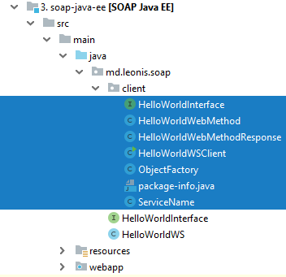

## SOAP HelloWorld для Java EE

[Ссылка на репозиторий](../soap-java-ee)

Веб-сервисы почти так же легко можно разворачивать в серверах приложений.
Скорее всего, в подавляющем большинстве случаев веб-сервисы работают именно в серверах приложений.
Иначе не объяснить такое резкое одновременное падение популярности Java EE и SOAP.

Проблема выбора и установки сервера приложений выходит за рамки этой статьи. Мы будем пользоваться `WildFly` (бывший `JBoss`).

Файл `pom.xml` не сильно изменился. 
Основные отличия такие: теперь мы создаём `WAR` артефакт и не будем паниковать если файл `web.xml` отсутствует.

```xml
<packaging>war</packaging>

    <properties>
        <failOnMissingWebXml>false</failOnMissingWebXml>
    </properties>
```

Интерфейс:

```java
package md.leonis.soap;

import javax.jws.WebMethod;
import javax.jws.WebService;

@WebService(name = "HelloWorldInterface", targetNamespace = "http://soap.leonis.md/")
public interface HelloWorldInterface {

    @WebMethod
    String helloWorldWebMethod(String name);
}
```

Сервис:

```java
package md.leonis.soap;

import javax.jws.WebService;

@WebService(serviceName = "serviceName", portName = "portName",
      endpointInterface = "md.leonis.soap.HelloWorldInterface", targetNamespace = "http://soap.leonis.md/")
public class HelloWorldWS implements HelloWorldInterface {

   @Override
   public String helloWorldWebMethod(String name) {
      return "Hello World JAX-WS " + name;
   }
}
```

Обратите внимание на поля аннотации `@WebService`:

* `serviceName` - возможность переименовать сервис. То есть, снаружи он будет виден как `serviceName`. По умолчанию `HelloWorldWSService`.
* `portName` - возможность переименовать порт. То есть, снаружи он будет виден как `portName`. По умолчанию `HelloWorldWSPort`.
* `endpointInterface` - это полное имя реализуемого интерфейса. 
* `targetNamespace` - по умолчанию это элементы названия пакета переставленные наоборот. Спереди добавляется `"http://"`, сзади `"/"`.
То есть, в нашем примере это поле избыточно. Уж если указывать, то в одном месте, а не в двух, как в примере. Если значения будут различаться, то это приведёт к тяжёлым последствиям при генерации WSDL файла.
* `name` - нельзя использовать вместе с полем `endpointInterface`. По-сути, это синоним для веб-службы. Уж если используем (например, `name = "name"`), 
то клиент должен быть несколько иным: `HelloWorldInterface hello = service.getPort(new QName("http://soap.leonis.md/", "namePort"), HelloWorldInterface.class);`
* `wsdlLocation` - путь к WSDL файлу. Имеет смысл указывать, если WSDL-файл по какой-то причине отличается от генерируемого автоматически. Например, в него включены XSD-схемы. Возможно так же, что загрузка с диска не так нагружает процессор. По умолчанию WSDL-документ генерируется автоматически при запуске ендпоинта. 
Пример `wsdlLocation = "wsdl/HelloWorldWSService.wsdl"`. Пример ошибки, если WSDL файл не был найден 
`Exception in thread "main" com.sun.xml.internal.ws.server.ServerRtException: [failed to localize] cannot.load.wsdl(MyService.wsdl)`

Возможные поля для аннотации `@WebMethod`:

* `operationName` - имя операции, связанной с текущим методом. По умолчанию это название самого метода. То есть, это возможность переименовать метод и не более того.
* `action` - действие для этой операции. По умолчанию что-то вроде `http://soap.leonis.md/HelloWorldInterface/helloWorldWebMethodRequest`. Для SOAP привязки это значение SOAPAction заголовка.
Пока непонятно где это используется на практике.
* `exclude` - возможность не показывать метод в веб-сервисе. Надо указывать только в классе-реализации сервиса, при этом первые два элемента (`operationName`, `action`) недопустимы.

Собираем, деплоим, смотрим логи сервера.

```
Adding service endpoint metadata: id=md.leonis.soap.HelloWorldWS
 address=http://localhost:8080/soap-java-ee-1.0-SNAPSHOT/serviceName
 implementor=md.leonis.soap.HelloWorldWS
 serviceName={http://soap.leonis.md}serviceName
 portName={http://soap.leonis.md}portName
 annotationWsdlLocation=null
 wsdlLocationOverride=null
 mtomEnabled=false
Creating Service {http://soap.leonis.md}serviceName from class md.leonis.soap.HelloWorldInterface
Setting the server's publish address to be http://localhost:8080/soap-java-ee-1.0-SNAPSHOT/serviceName
WSDL published to: file:/C:/wildfly/standalone/data/wsdl/soap-java-ee-1.0-SNAPSHOT.war/serviceName.wsdl
```

Ендпоинт `md.leonis.soap.HelloWorldWS` доступен по адресу http://localhost:8080/soap-java-ee-1.0-SNAPSHOT/serviceName, так же видим название порта. 
`WSDL` файл генерируется автоматически и сохраняется на диск где-то в недрах контейнера.

Все перечисленные значения знакомые, мы их указали в аннотациях. Это было сделано с одной целью – показать, что настраивать, на самом деле, можно много чего.

Ничто нам не мешает тут же вызвать этот сервис, или, хотя бы, получить его WSDL файл, но URL не слишком-то и красивый. Давайте его улучшим. 
В каталоге `/main` создадим каталог `webapp/WEB-INF`, а в нём файл `jboss-web.xml`. Для других контейнеров существуют аналогичные инструменты настройки.

```xml
<?xml version="1.0" encoding="UTF-8"?>
<jboss-web xmlns="http://www.jboss.com/xml/ns/javaee"
           xmlns:xsi="http://www.w3.org/2001/XMLSchema-instance"
           xsi:schemaLocation="
      http://www.jboss.com/xml/ns/javaee
      http://www.jboss.org/j2ee/schema/jboss-web_5_1.xsd">
    <context-root>/hello</context-root>
</jboss-web>
```

Только что мы заменили название артефакта `soap-java-ee-1.0-SNAPSHOT` на простое “`hello`”. Смотрим логи сервера:

```
Adding service endpoint metadata: id=md.leonis.soap.HelloWorldWS
 address=http://localhost:8080/hello/serviceName
 implementor=md.leonis.soap.HelloWorldWS
 serviceName={http://soap.leonis.md}serviceName
 portName={http://soap.leonis.md}portName
 annotationWsdlLocation=null
 wsdlLocationOverride=null
 mtomEnabled=false
Creating Service {http://soap.leonis.md}serviceName from class md.leonis.soap.HelloWorldInterface
Setting the server's publish address to be http://localhost:8080/hello/serviceName
```

*Если очень хочется, то можно указать `<context-root>/</context-root>` и получить ещё более простой URL: http://localhost:8080/serviceName*

Кстати, если кто не знает, есть возможность ещё немного настроить ендпоинты. Там же создаём файл `web.xml`:

```xml
<?xml version="1.0"?>
<web-app xmlns="http://xmlns.jcp.org/xml/ns/javaee"
         xmlns:xsi="http://www.w3.org/2001/XMLSchema-instance"
         xsi:schemaLocation="http://xmlns.jcp.org/xml/ns/javaee
		 http://xmlns.jcp.org/xml/ns/javaee/web-app_3_1.xsd" 
         version="3.1">

    <servlet>
        <servlet-name>Hello World WebService</servlet-name>
        <servlet-class>md.leonis.soap.HelloWorldWS</servlet-class>
    </servlet>
    <servlet-mapping>
        <servlet-name>Hello World WebService</servlet-name>
        <url-pattern>/newEndpoint</url-pattern>
    </servlet-mapping>

</web-app>
```

Логи:

```
Adding service endpoint metadata: id=Hello World WebService
 address=http://localhost:8080/hello/newEndpoint
 implementor=md.leonis.soap.HelloWorldWS
 serviceName={http://soap.leonis.md}serviceName
 portName={http://soap.leonis.md}portName
 annotationWsdlLocation=null
 wsdlLocationOverride=null
 mtomEnabled=false
Creating Service {http://soap.leonis.md}serviceName from class md.leonis.soap.HelloWorldInterface
Setting the server's publish address to be http://localhost:8080/hello/newEndpoint
```

### Генерация SOAP-клиента на основе WSDL файла

Давайте воспользуемся существующим WSDL документом, чтобы сгенерировать клиента для нашей веб-службы. Для этого отлично подойдёт утилита `wsimport` из `JDK`, её настройки во многом напоминают `wsgen`:

`wsimport -d ./target/classes -s ./src/main/java -verbose -p md.leonis.soap.client http://localhost:8080/hello/newEndpoint?wsdl`

WSDL-документ скачивается и на его основе генерируется целое семейство классов:



Класс `HelloWorldWSClient`, правда, ещё предстоит написать, но он является упрощённой версией клиентов, которые мы видели ранее:

```java
public class HelloWorldWSClient {
 
   public static void main(String[] args) {
        Service service = new ServiceName();
        HelloWorldInterface hello = service.getPort(HelloWorldInterface.class);
        System.out.println(hello.helloWorldWebMethod("Leonis"));
    }
}
```

Утилита `wsimport` может так же работать и с `WSDL-файлами`, пример такого параметра: `-wsdlLocation ../src/resources/META-INF/service.wsdl`

### Генерация SOAP-клиента на основе WSDL файла и XSD-схемы

Если XSD-схемы идут отдельно, то их следует тоже подать на вход `wsimport` с ключом `-b`:

`wsimport HelloWorldWSService.wsdl -b HelloWorldWSService_schema1.xsd`

### Генерация SOAP-клиента с помощью Apache CXF

При работе с фреймворком `Apache CXF` можно воспользоваться следующей утилитой:

`wsdl2java.bat -p md.leonis.soap -client -server -impl -b HelloWorldWSService_schema1.xsd -wsdlLocation classpath:wsdl/HelloWorldWSService.wsdl HelloWorldWSService.wsdl`

В данном случае из `WSDL` и `XSD` файлов генерируются сразу клиент, сервер, а также реализация-заглушка. 
Отдельно следует обратить внимание на ключ `-wsdlLocation classpath:wsdl/HelloWorldWSService.wsdl`. 
Он говорит о том, что WSDL файл `HelloWorldWSService.wsdl` в приложении будет находиться в каталоге `/resources/wsdl`. Вот пример сгенерированного сервиса:

```java
public class HelloWorldWSService extends Service {

    public final static URL WSDL_LOCATION;

    public final static QName SERVICE = new QName("http://soap.leonis.md/", "HelloWorldWSService");
    public final static QName HelloWorldWSPort = new QName("http://soap.leonis.md/", "HelloWorldWSPort");
    static {
        URL url = HelloWorldWSService.class.getClassLoader().getResource("wsdl/HelloWorldWSService.wsdl");
        if (url == null) {
            java.util.logging.Logger.getLogger(HelloWorldWSService.class.getName())
                .log(java.util.logging.Level.INFO,
                     "Can not initialize the default wsdl from {0}", "classpath:wsdl/HelloWorldWSService.wsdl");
        }
        WSDL_LOCATION = url;
    }
```

Если не указать ключ `-wsdlLocation classpath:wsdl/HelloWorldWSService.wsdl`, то сервис будет несколько иным:

```java
    public final static QName SERVICE = new QName("http://soap.leonis.md/", "HelloWorldWSService");
    public final static QName HelloWorldWSPort = new QName("http://soap.leonis.md/", "HelloWorldWSPort");
    static {
        URL url = null;
        try {
            url = new URL("file:HelloWorldWSService.wsdl");
        } catch (MalformedURLException e) {
            java.util.logging.Logger.getLogger(HelloWorldWSService.class.getName())
                .log(java.util.logging.Level.INFO,
                     "Can not initialize the default wsdl from {0}", "file:HelloWorldWSService.wsdl");
        }
        WSDL_LOCATION = url;
    }
   
```

Тут очень тонкий момент - если клиент будет деплоиться в контейнер, то первый вариант сгодится.

Весь остальной исходный код доступен в репозитории. Обратите внимание, что клиент в случае `Apache CXF` генерируется сразу, не надо ничего писать. 

Подробнее об этой замечательной утилите можно прочесть тут: https://cxf.apache.org/docs/wsdl-to-java.html или далее.

**Это тот минимальный "джуниорский" набор знаний, который необходим для начала работы с JAX-WS и SOAP. Всё остальное есть на просторах сети.**

Далее мы рассмотрим несколько случаев, более приближенных к реальной жизни.

[<< назад](chapter-3.5.md) | [⌂ оглавление](../README.md) | [далее >>](chapter-5.md)