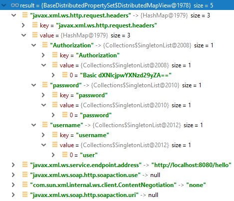

## SOAP HelloWorld для Java SE с BASIC Authentication

[Ссылка на репозиторий](./soap-java-se-password-auth)

Давайте рассмотрим пример того, как написать клиент для работы с защищёнными ендпоинтами.
Начнём с очень простого случая - будем передавать в заголовках имя пользователя с паролем.

### Случай с именем пользователя и паролем

Интерфейс сервиса. Ничего необычного:

```java
@WebService
   public interface HelloWorld {
   
       @WebMethod
       String getHelloWorldAsStringPassword();
   }
```

Реализация сервиса. Для обращения к заголовкам нам понадобится контекст веб-сервисов `WebServiceContext`.
Из него можно достать много полезной информации, но сейчас нас интересуют HTTP-заголовки.

```java
@WebService(endpointInterface = "md.leonis.soap.HelloWorld")
public class HelloWorldImpl implements HelloWorld {

    @Resource
    WebServiceContext webServiceContext;

    @Override
    public String getHelloWorldAsStringPassword() {

        MessageContext messageContext = webServiceContext.getMessageContext();

        Map http_headers = (Map) messageContext.get(MessageContext.HTTP_REQUEST_HEADERS);

        List userList = (List) http_headers.get("username");
        List passList = (List) http_headers.get("password");

        String username = "";
        String password = "";

        if (userList != null) {
            username = userList.get(0).toString();
        }

        if (passList != null) {
            password = passList.get(0).toString();
        }

        if (username.equals("user") && password.equals("password")) {
            return "Hello World JAX-WS - Valid User!";
        } else {
            return "Unknown User!";
        }
    }
}
```

Происходит простейшая проверка имени пользователя и пароля. Проверок в коде явно маловато, он написан в учебных целях.

Паблишер обычный:

```java
public class HelloWorldPublisher {

    public static void main(String[] args) {
        Endpoint.publish("http://localhost:8080/hello", new HelloWorldImpl());
    }
}
```

А вот в клиенте появились новые конструкции:

```java
public class HelloWorldClient {

    private static final String WS_URL = "http://localhost:8080/hello?wsdl";

    public static void main(String[] args) throws Exception {

        URL url = new URL(WS_URL);
        QName qname = new QName("http://soap.leonis.md/", "HelloWorldImplService");

        Service service = Service.create(url, qname);
        HelloWorld hello = service.getPort(HelloWorld.class);

        Map<String, Object> req_ctx = ((BindingProvider) hello).getRequestContext();

        Map<String, List<String>> headers = new HashMap<>();
        headers.put("username", Collections.singletonList("user"));
        headers.put("password", Collections.singletonList("password"));

        req_ctx.put(MessageContext.HTTP_REQUEST_HEADERS, headers);

        System.out.println(hello.getHelloWorldAsStringPassword());
        System.out.println(hello.getHelloWorldAsStringBasic());
    }
}
```

Мы получаем объект `BindingProvider`, провайдер привязки, который, по-сути тоже очень многофункциональный.
Через него обращаемся к контексту запроса и добавляем в него необходимые нам заголовки.
Вот как теперь выглядит контекст запроса:



Вместо `"username"` и `"password"` можно использовать `BindingProvider.USERNAME_PROPERTY` и `BindingProvider.PASSWORD_PROPERTY`, правда,
надо помнить, что:

* USERNAME_PROPERTY = "javax.xml.ws.security.auth.username";
* PASSWORD_PROPERTY = "javax.xml.ws.security.auth.password";

То есть, при отправке и получении надо использовать эти же константы.

### Случай с BASIC Authentication 

По сравнению с предыдущим примером нам мало чего придётся поменять.

Клиент: отправляем валидный заголовок `Authorization`. Он будет примерно таким: `Basic dXNlcjpwYXNzd29yZA==`:

```java
String usernameColonPassword = "user:password";
String basicAuthPayload = "Basic " + Base64.getEncoder().encodeToString(usernameColonPassword.getBytes());
headers.put("Authorization", Collections.singletonList(basicAuthPayload));
```

Сервис: разбираем этот заголовок:

```java
List authList = (List) http_headers.get("Authorization");

String username = "";
String password = "";

if (authList != null && authList.get(0).toString().toLowerCase().startsWith("basic")) {
   String basicAuthPayload = authList.get(0).toString();
   String payload = basicAuthPayload.replace("Basic ", "");
   byte[] decodedBytes = Base64.getDecoder().decode(payload);
   String usernameColonPassword = new String(decodedBytes);
   String[] values = usernameColonPassword.split(":");
   username = values[0];
   password = values[1];
}
```

Всё просто, правда, серверную часть так никто не пишет. Обычно контейнер сервлетов берёт вопросы аутентификации на себя.
Да и клиент врядли будет хранить пароли внутри себя. Куда разумнее передавать их извне.

[<< назад](chapter-5.md) | [⌂ оглавление](../README.md) | [далее >>](chapter-7.md)