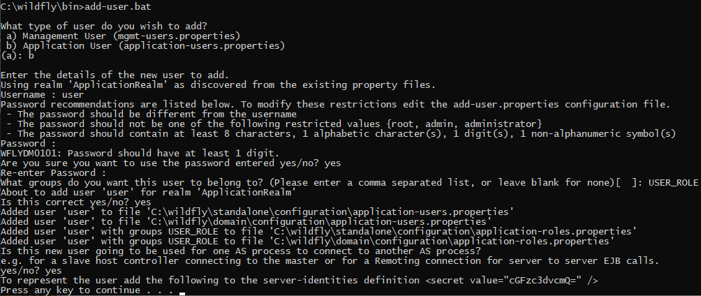

## SOAP HelloWorld для Java SE с BASIC Authentication

[Ссылка на репозиторий сервера](./soap-java-ee-basic-auth)
[Ссылка на репозиторий клиента](./soap-java-ee-basic-auth-client)

## SOAP HelloWorld для Java EE с BASIC Authentication 

Этот пример более приближен к реальной жизни.

Сначала добавим пользователя приложения в `Wildfly`:

В `bin` каталоге `WildFly` выполняем команду `add-user.bat`:

Добавим пользователя `user` с паролем `password`.



Если кому интересно, то в файлах `application-roles.properties` (их два) будет: `user=USER_ROLE`

а в файлах `application-users.properties` (их два) будет: `user=70fa846ee00b3dd28dbcbe83fb38a660`

Теперь настраиваем файл `web.xml`:

Для простоты закроем доступ ко всем ресурсам сервера:

```xml
    <security-constraint>
        <web-resource-collection>
            <web-resource-name>BASIC-Auth</web-resource-name>
            <description>Security constraints</description>
            <url-pattern>/*</url-pattern>
        </web-resource-collection>
        <auth-constraint>
            <role-name>USER_ROLE</role-name>
        </auth-constraint>
    </security-constraint>

    <login-config>
        <auth-method>BASIC</auth-method>
        <realm-name>ApplicationRealm</realm-name>
    </login-config>

    <security-role>
        <role-name>USER_ROLE</role-name>
    </security-role>
```


А теперь вопрос - как написать клиент? Все клиенты, рассмотренные ранее читали WSDL файл напрямую из ендпоинта. А в нашем случае он закрыт.

Давайте возьмём уже сгенерированный клиент из примера `SOAP HelloWorld для Java EE` и будем его модифицировать.

### Прямая аутентификация

Одно из возможных решений - аутентифицироваться до того, как произойдёт обращение к ендпоинту.

В классе ServiceName добавляем в `static` блок следующий код:

```java
Authenticator myAuth = new Authenticator() {
    @Override
    protected PasswordAuthentication getPasswordAuthentication() {
         return new PasswordAuthentication("user", "password".toCharArray());
    }
};

Authenticator.setDefault(myAuth);
```

Это очень простое решение, но к сожалению, в производстве оно не всегда применимо, поскольку, имя пользователя и пароль
могут храниться в базе данных или каком-то защищённом хранилище, или просто, в файле настроек.

### Работа с сохранённым WSDL-файлом

Давайте сохраним WSDL-файл и будем использовать его вместе с проектом. Открываем ссылку http://localhost:8080/hello/serviceName?wsdl.
Сохраним документ как `ServiceName.wsdl` в каталоге `resources/wsdl`.

Будем работать с классом `ServiceName`.

Сначала уберём из аннотации `@WebServiceClient` - `wsdlLocation`. Чтение происходит при старте, в это время у нас ещё нет данных для аутентификации.

```java
@WebServiceClient(name = "serviceName", targetNamespace = "http://soap.leonis.md/", wsdlLocation = "http://localhost:8080/hello/serviceName?wsdl")
```

Далее модифицируем статический блок.

```java
        URL url = null;
        WebServiceException e = null;
        try {
            url = Service.class.getClassLoader().getResource("wsdl/ManageExchangeWSDL.WSDL");
        } catch (Exception ex) {
            e = new WebServiceException(ex);
        }
        SERVICENAME_WSDL_LOCATION = url;
        SERVICENAME_EXCEPTION = e;
```

Поскольку в этом решении мы читаем из ресурсов, то и выполнять надо уже `JAR-файл`.

```
mvn clean package
java -jar ./target/soap-java-ee-basic-auth-client-1.0-SNAPSHOT.jar 
```

Всё работает. 

А как быть при отладке в `IDE`? Можно, например, передавать полный путь к WSDL-файлу в командной строке.

Класс `HelloWorldWSClient`:

```java
Service service;

if (args.length > 0) {
    service = new ServiceName(args[0]);
} else {
    service = new ServiceName();
}
```

Класс `ServiceName` мы отрефакторим.

```java
import javax.xml.namespace.QName;
import javax.xml.ws.*;
import java.io.File;
import java.net.URL;

/**
 * This class was generated by the JAX-WS RI.
 * JAX-WS RI 2.2.9-b130926.1035
 * Generated source version: 2.2
 * <p>
 * Modified!!!
 */
@WebServiceClient(name = "serviceName", targetNamespace = "http://soap.leonis.md/")
public class ServiceName extends Service {

    private static URL SERVICENAME_WSDL_LOCATION;
    private final static QName SERVICENAME_QNAME = new QName("http://soap.leonis.md/", "serviceName");

    public ServiceName() {
        super(getWsdlLocation(null), SERVICENAME_QNAME);
    }

    public ServiceName(String wsdlPath) {
        super(getWsdlLocation(wsdlPath), SERVICENAME_QNAME);
    }

    /**
     * @return returns HelloWorldInterface
     */
    @WebEndpoint(name = "portName")
    public HelloWorldInterface getPortName() {
        return super.getPort(new QName("http://soap.leonis.md/", "portName"), HelloWorldInterface.class);
    }

    /**
     * @param features A list of {@link WebServiceFeature} to configure on the proxy.  Supported features not in the <code>features</code> parameter will have their default values.
     * @return returns HelloWorldInterface
     */
    @WebEndpoint(name = "portName")
    public HelloWorldInterface getPortName(WebServiceFeature... features) {
        return super.getPort(new QName("http://soap.leonis.md/", "portName"), HelloWorldInterface.class, features);
    }

    private static URL getWsdlLocation(String wsdlPath) {
        if (SERVICENAME_WSDL_LOCATION != null) {
            return SERVICENAME_WSDL_LOCATION;
        }

        try {
            if (wsdlPath != null) {
                SERVICENAME_WSDL_LOCATION = new File(wsdlPath).toURI().toURL();
            } else {
                SERVICENAME_WSDL_LOCATION = ServiceName.class.getClassLoader().getResource("wsdl/ServiceName.wsdl");
            }
        } catch (Exception ex) {
            throw new WebServiceException(ex);
        }

        return SERVICENAME_WSDL_LOCATION;
    }

}
```

Теперь этот класс сначала пытается обратиться к файлу, переданному из командной строки, а если его нет, то читает из ресурсов.

[<< назад](chapter-6.md) | [⌂ оглавление](../README.md) | [далее >>](chapter-7.5.md)